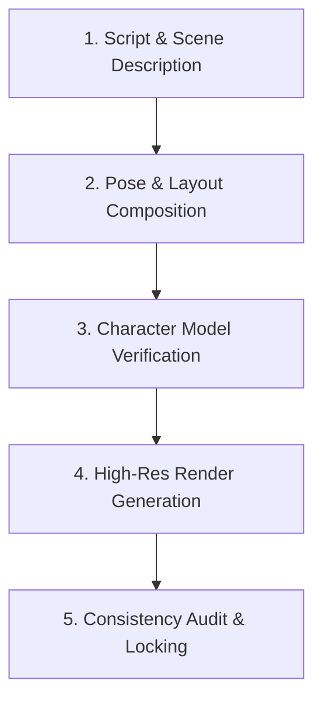

# Art Style & Production Pipeline Guide

This document defines the visual rendering rules and production process for creating all **54+ illustrations** with 100% character and environmental consistency.

---

## 🎨 Art Style Rules (*Curious George* Aesthetic)

1. **Linework:**
   - Soft brown/dark grey ink outlines, clean and hand-drawn.
   - Line weight scales naturally with distance (thicker outlines on foreground characters, finer lines on background elements).

2. **Coloring & Shading:**
   - Traditional flat watercolor wash texture.
   - Soft, gentle gradients; avoid glossy digital 3D lighting or hyper-realistic reflections.
   - Warm sunlit ambiance throughout daytime scenes.

3. **Background Architecture:**
   - Simplified classic townscapes, parks, and cozy home interiors.
   - Painterly trees with soft cloud-like foliage clusters (inspired by H.A. Rey's original style).

---

## 🔄 Page Production Pipeline (5-Step Process)

### Step 1: Manuscript Breakdown
- Extract target narrative line(s) for the specific page.
- Identify required characters, emotions, actions, and background setting.

### Step 2: Pose & Layout
- Plan composition (e.g. left page vs right page, spread, focal point).

### Step 3: Model Alignment
- Check [`READMES/character_model_sheet.md`](file:///f:/Antigravity/Illustrator%20Work/READMES/character_model_sheet.md) to ensure exact eye shape, outfit, and dog proportions are fed as prompt constraints.

### Step 4: Generation & Review
- Render image using locked reference prompts and reference model paths.

### Step 5: Master Document Logging
- Log page status, image asset link, and approval in [`MASTER.md`](file:///f:/Antigravity/Illustrator%20Work/MASTER.md).
